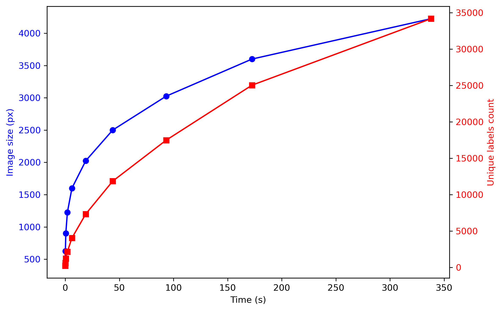
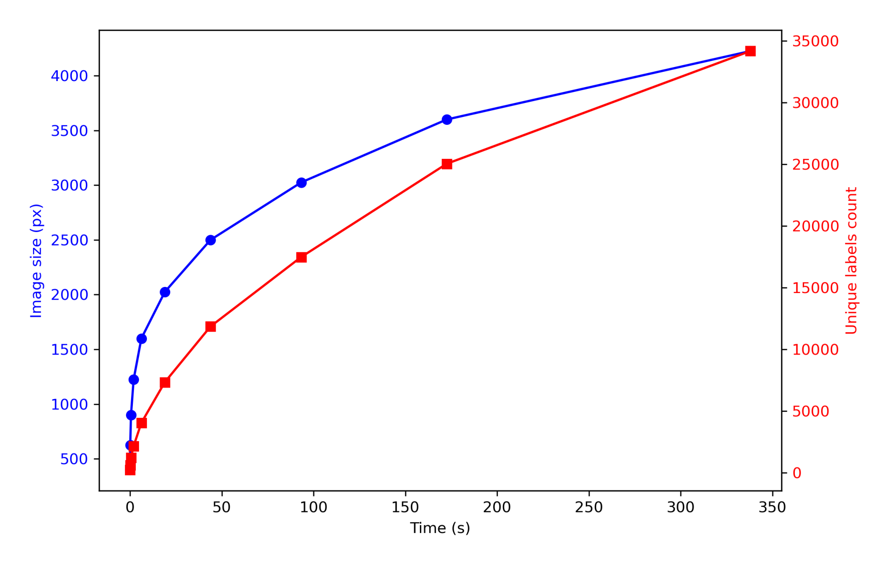

# Runtime of the stitching algorithm


<!-- WARNING: THIS FILE WAS AUTOGENERATED! DO NOT EDIT! -->

``` python
mask_path = "../data/local/2025-06-04_IHC_51-1-5_2_Merged_ch00_no_BG_global_mask.npy"
ps = 0.539
```

``` python
global_mask = np.load(mask_path)
```

``` python
cell_labels_vector = []
n_labels = []
timings = []
start_idx = 5000

vector = np.array(list(range(20, 70, 5)))**2

for increment in range(20, 70, 5):
    region = global_mask[start_idx:start_idx+increment**2, start_idx:start_idx+increment**2]
    unique_non_zero = len(np.unique(region[region != 0]))
    start_time = time.time()
    cell_labels = expand_with_cap(
        region,
        spacing=ps,
        fixed_expand=5.0,
        max_area_ratio=5.0
    )
    elapsed = time.time() - start_time
    n_labels.append(unique_non_zero)
    timings.append(elapsed)
    cell_labels_vector.append(cell_labels)
```

    Increment: 400, Time: 0.042 s
    Increment: 625, Time: 0.138 s
    Increment: 900, Time: 0.533 s
    Increment: 1225, Time: 1.984 s
    Increment: 1600, Time: 6.187 s
    Increment: 2025, Time: 18.973 s
    Increment: 2500, Time: 43.852 s
    Increment: 3025, Time: 93.243 s
    Increment: 3600, Time: 172.568 s
    Increment: 4225, Time: 337.987 s

``` python
fig, ax1 = plt.subplots(figsize=(8, 5))

# Plot vector vs. timings on the left y-axis (x-axis is time)
ax1.plot(timings, vector, marker='o', color='blue', label='Vector')
ax1.set_xlabel('Time (s)')
ax1.set_ylabel('Image size (px)', color='blue')
ax1.tick_params(axis='y', labelcolor='blue')

# Create a second y-axis and plot n_labels vs. timings on it
ax2 = ax1.twinx()
ax2.plot(timings, n_labels, marker='s', color='red')
ax2.set_ylabel('Unique labels count', color='red')
ax2.tick_params(axis='y', labelcolor='red')
plt.tight_layout()
plt.savefig('../data/runtime_eval.png', dpi=300)
plt.show()
```



This is probably the most time-consuming step when working with large
whole-slide scans. Regardless of how many labels you have,
[`expand_with_cap`](https://plezar.github.io/NEST/labels.html#expand_with_cap)
computes the exact Euclidean distance for every background pixel. Since
time complexity is a function of *K* (number of unique labels) and *N*
(number of pixels), and *K* grows proportionally with *N*, the overall
time complexity is *O*(*N*<sup>2</sup>).

``` python
img = plt.imread('../data/runtime_eval.png')
plt.figure(figsize=(8, 5))
plt.imshow(img)
plt.axis('off')
plt.show()
```


