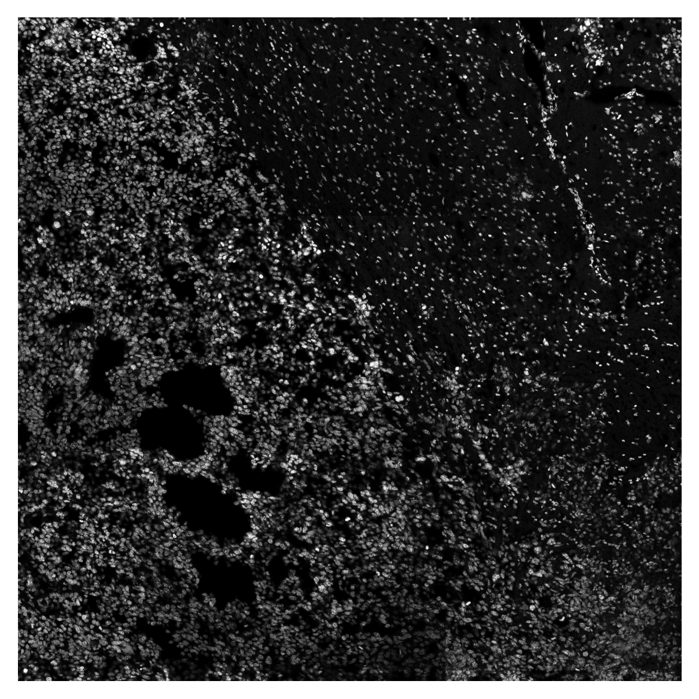
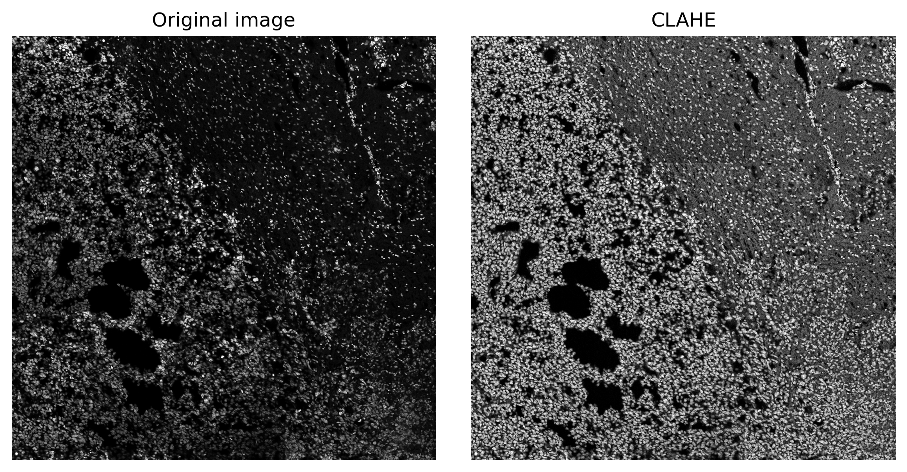
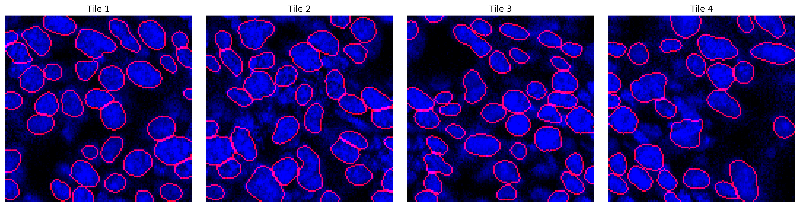
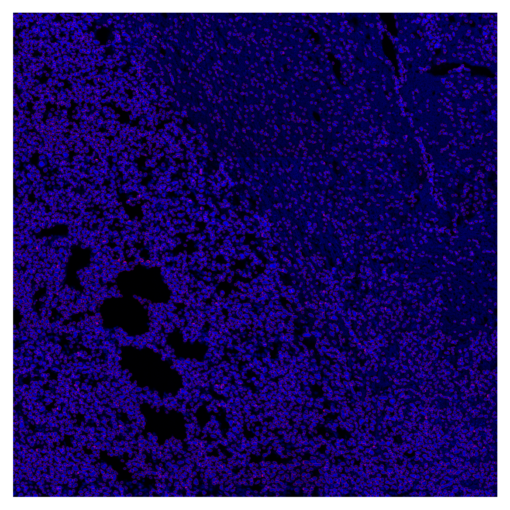
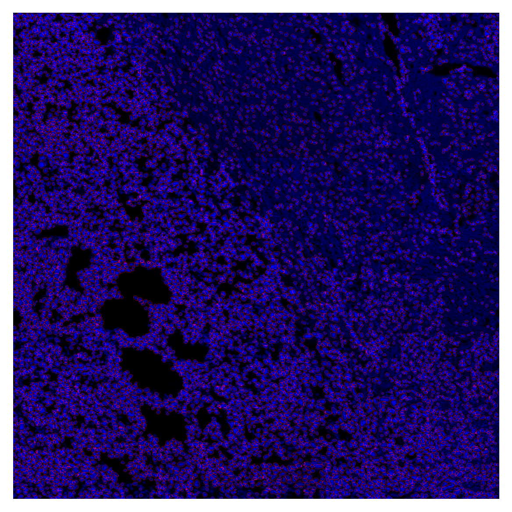

# NEST


<!-- WARNING: THIS FILE WAS AUTOGENERATED! DO NOT EDIT! -->

<figure>

<figcaption aria-hidden="true">Logo</figcaption>
</figure>

Below you’ll find everything you need to get started with NEST, from
installing the package to running a complete segmentation pipeline on
your own images. The typical workflow involves:

1.  Loading and visualizing your raw image  
2.  Correcting illumination artifacts using CLAHE  
3.  Dividing the image into overlapping tiles  
4.  Segmenting nuclei with a pre‐trained CellPose model  
5.  Stitching the tile‐level masks back into a full‐image segmentation  
6.  Expanding nuclear labels to approximate cell boundaries  
7.  Overlaying outlines and exporting results

### Installation

Install latest from the GitHub
[repository](https://github.com/plezar/NEST):

``` sh
$ pip install git+https://github.com/plezar/NEST.git
```

or from [conda](https://anaconda.org/plezar/NEST)

``` sh
$ conda install -c plezar NEST
```

or from [pypi](https://pypi.org/project/NEST/)

``` sh
$ pip install NEST
```

### Documentation

Documentation can be found hosted on this GitHub
[repository](https://github.com/plezar/NEST)’s
[pages](https://plezar.github.io/NEST/). Additionally you can find
package manager specific guidelines on
[conda](https://anaconda.org/plezar/NEST) and
[pypi](https://pypi.org/project/NEST/) respectively.

### How to use

The core inputs required to run NEST are:

1.  **Input Image**  
    A grayscale microscopy image (TIFF or similar) containing the nuclei
    you wish to segment.

2.  **CellPose Model**  
    Path to a pre-trained CellPose model.

3.  **Expansion Radius (µm)**  
    The distance (in micrometers) by which to expand the nuclear masks
    to approximate whole-cell boundaries.

Given these inputs, NEST will:

- Load and enhance the image for uniform illumination.
- Split the image into overlapping tiles.
- Run segmentation on each tile.
- Stitch tile masks into a global mask.
- Optionally expand masks to full-cell labels.

``` python
filename = "../data/example_image.tif"
model_path = "../data/example_model"
radius_um = 5.0
```

### Example Workflow

#### Reading the Input Image

We provide a sample image in the data folder. This image was acquired
using a Leica Stellaris Dive system by stitching multiple 1024×1024
fields of view:

``` python
image = cv2.imread(filename, cv2.IMREAD_UNCHANGED)

plt.imshow(image, cmap='grey')
plt.axis('off')
plt.show()
```



### Flat-Field Correction with CLAHE

Microscopy images often suffer from uneven illumination due to optical
and sample variations. NEST uses Contrast Limited Adaptive Histogram
Equalization (CLAHE) to address this:

- **Local Processing**: The image is divided into small tiles (matching
  the stitching grid).
- **Histogram Equalization**: Each tile’s brightness distribution is
  equalized independently.
- **Contrast Limiting**: A `clip_limit` prevents over-enhancement of
  noise.
- **Seamless Merging**: Tiles are blended back together to produce a
  smoothly corrected image.

``` python
image_enh = clahe(image, clip_limit = 4, tile_grid_size = count(image, t = 24, v = 0.1))
```

``` python
fig, (ax1, ax2) = plt.subplots(1, 2, figsize=(8, 4))

ax1.imshow(image, cmap='grey')
ax1.set_title('Original image')
ax1.axis('off')

ax2.imshow(image_enh, cmap='grey')
ax2.set_title('CLAHE')
ax2.axis('off')

plt.tight_layout()
plt.show()
```



Notice that local brightness gradients are flattened while preserving
fine nuclear details.

### Tiling the Enhanced Image

To maintain segmentation accuracy at the edges of each tile, NEST splits
the enhanced image into 128×128 pixel tiles with a 20-pixel overlap.
This overlap captures nuclei that span tile borders, reducing artifacts.
Larger overlap improves accuracy but increases computational load.

``` python
tiles, x, y = split(image_enh, tile_size = (128, 128), overlap = 20)
print(tiles.shape)
```

    (576, 128, 128)

### Segmentation

This example demonstrates nuclear segmentation, but the same workflow in
principle can be applied to any segmentation task (membrane or
cytoplasmic).

``` python
mask = predict(model_path, tiles, cellpose_param=(0.32, 0.08), use_gpu=True)
np.save('../cache/mask.npy', mask)
```

``` python
mask = np.load('../cache/mask.npy')
```

``` python
fig, axes = plt.subplots(1, 4, figsize=(16,4))
titles = ['Tile 1', 'Tile 2', 'Tile 3', 'Tile 4']

for ax, m, img, title in zip(axes, mask[:4], tiles[:4], titles):
    overlay = plot_outlines(m, img)
    ax.imshow(overlay)
    ax.axis('off')
    ax.set_title(title)

plt.tight_layout()
plt.show()
```



### Stitching

``` python
global_mask = stitch(mask, x, y, 0.2)
```

``` python
nuclei_overlay = plot_outlines(global_mask, image_enh, save_path="../data/nuclei_overlay.tif")
plt.imshow(nuclei_overlay)
plt.axis('off')
plt.show()
```



### Nuclear expansion

``` python
cell_labels = expand_with_cap(global_mask,
                             spacing = get_physical_size(filename, verbose=True),
                             fixed_expand=10.0)
```

    Pixel size = 0.534 × 0.534 µm/px
    Physical size = 1363.1 × 1363.1 µm

``` python
cell_overlay = plot_outlines(cell_labels, image_enh, save_path="../data/cell_overlay.tif")
plt.imshow(cell_overlay)
plt.axis('off')
plt.show()
```


