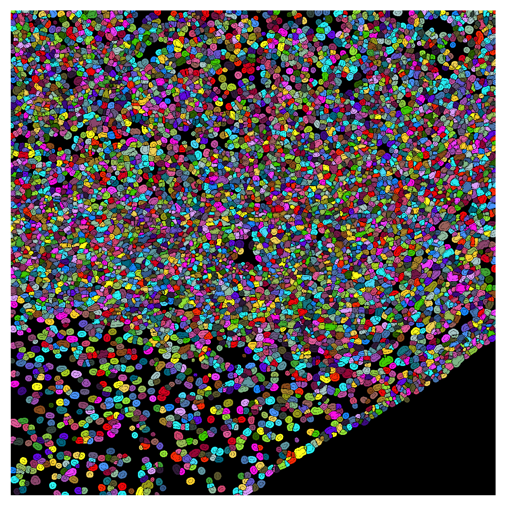
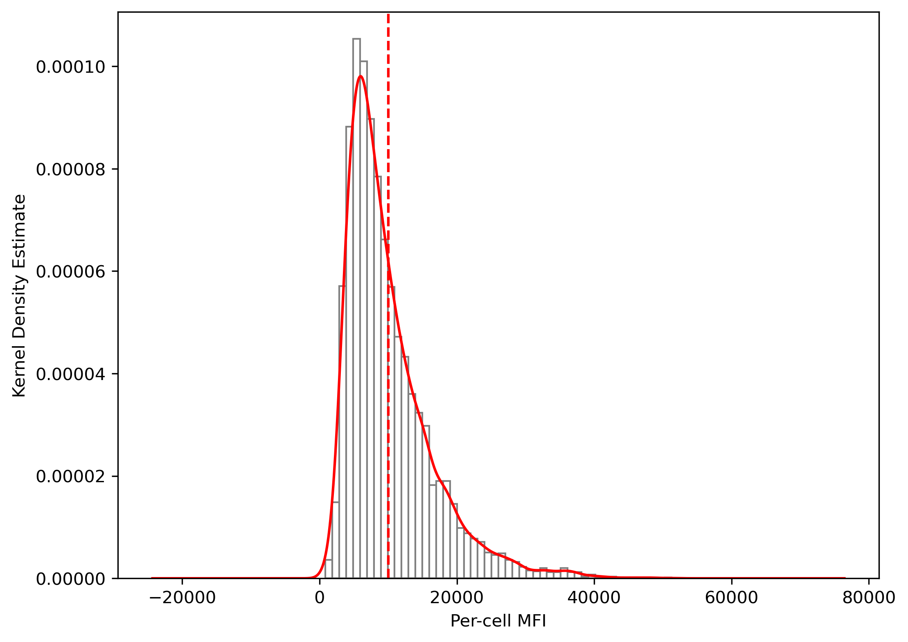
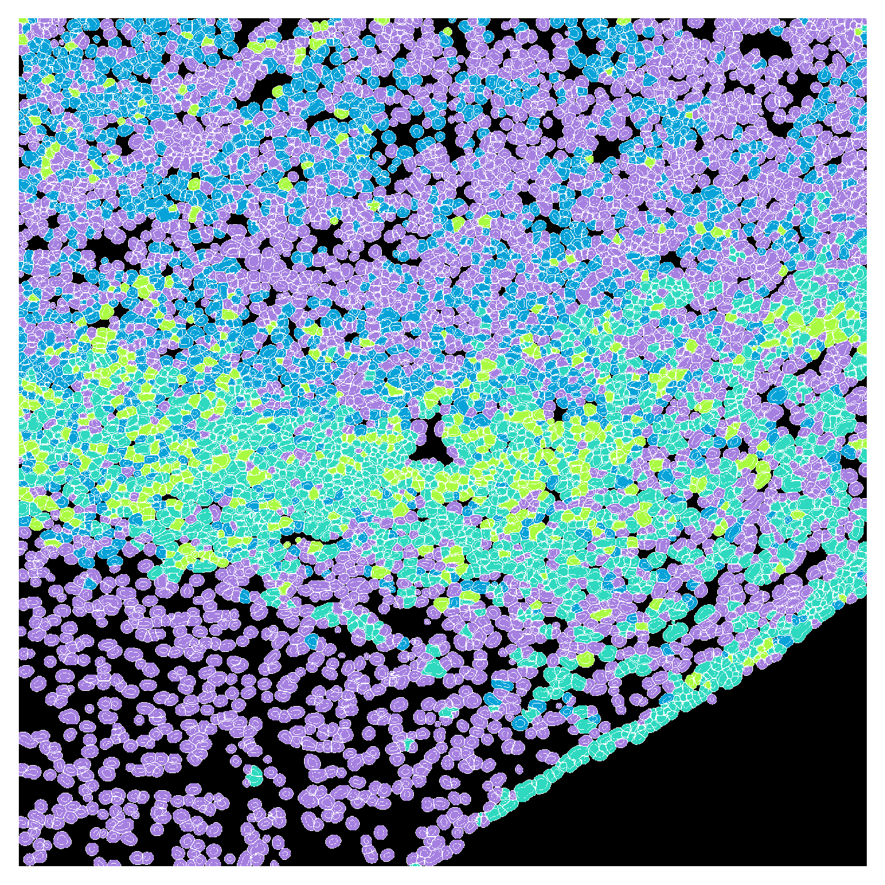
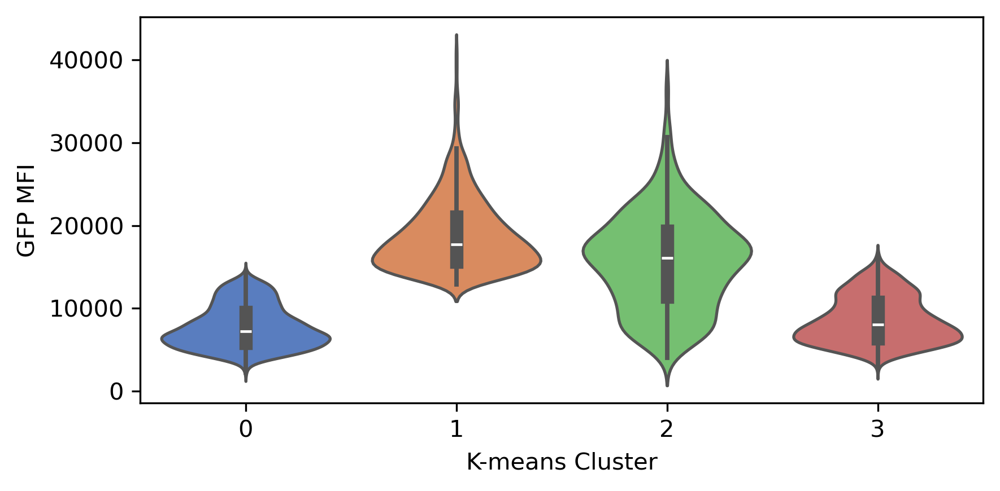
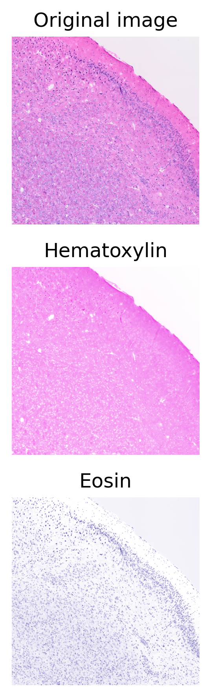
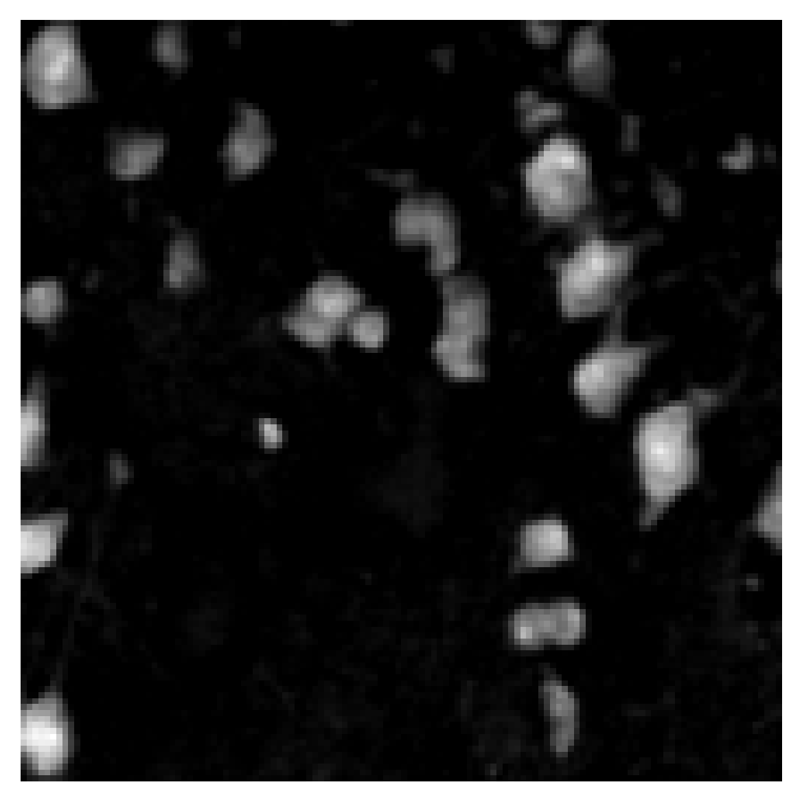
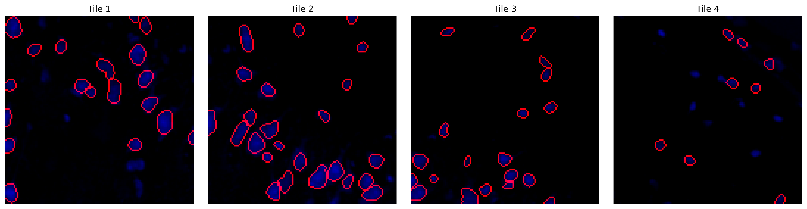
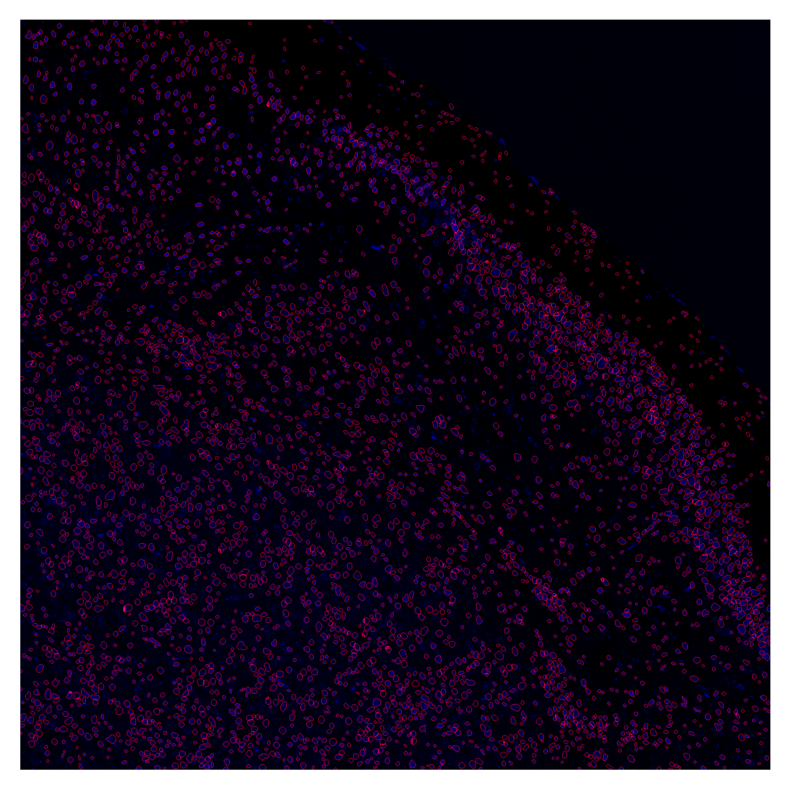

# NEST


<!-- WARNING: THIS FILE WAS AUTOGENERATED! DO NOT EDIT! -->

Below you’ll find everything you need to get started with NEST, from
installing the package to running a complete segmentation pipeline on
your own images. The typical workflow involves:

1.  Loading and visualizing your raw image  
2.  Correcting illumination artifacts using CLAHE  
3.  Dividing the image into overlapping tiles  
4.  Segmenting nuclei with a pre‐trained CellPose model  
5.  Stitching the tile‐level masks back into a full‐image segmentation  
6.  Expanding nuclear labels to approximate cell boundaries  
7.  Overlaying outlines and exporting results

### Installation

Install latest from the GitHub
[repository](https://github.com/plezar/NEST):

``` sh
$ pip install git+https://github.com/plezar/NEST.git
```

### Documentation

Documentation can be found hosted on this GitHub
[repository](https://github.com/plezar/NEST)’s
[pages](https://plezar.github.io/NEST/).

### How to use

The core inputs required to run NEST are:

1.  **Input Image**  
    A grayscale microscopy image (TIFF or similar) containing the nuclei
    you wish to segment.

2.  **CellPose Model**  
    Path to a pre-trained CellPose model.

3.  **Expansion Radius (µm)**  
    The distance (in micrometers) by which to expand the nuclear masks
    to approximate whole-cell boundaries.

Given these inputs, NEST will:

- Load and enhance the image for uniform illumination.
- Split the image into overlapping tiles.
- Run segmentation on each tile.
- Stitch tile masks into a global mask.
- Optionally expand masks to full-cell labels.

``` python
filename = "../data/example_image_ch00.tif"
model_path = "../data/example_model"
radius_um = 5.0
```

### Example Workflow for Fluorescence Microscopy Images

#### Reading the Input Image

We provide a sample image in the data folder. This image was acquired
using a Leica Stellaris Dive system by stitching multiple 1024×1024
fields of view:

``` python
image = cv2.imread(filename, cv2.IMREAD_UNCHANGED)

plt.imshow(image, cmap='grey')
plt.axis('off')
plt.show()
```


### Flat-Field Correction with CLAHE

Microscopy images often suffer from uneven illumination due to optical
and sample variations. NEST uses Contrast Limited Adaptive Histogram
Equalization (CLAHE) to address this:

- **Local Processing**: The image is divided into small tiles (matching
  the stitching grid).
- **Histogram Equalization**: Each tile’s brightness distribution is
  equalized independently.
- **Contrast Limiting**: A `clip_limit` prevents over-enhancement of
  noise.
- **Seamless Merging**: Tiles are blended back together to produce a
  smoothly corrected image.

``` python
image_enh = clahe(image, clip_limit = 3, tile_grid_size = count(image, t = 1024, v = 0.1))
```

``` python
fig, (ax1, ax2) = plt.subplots(1, 2, figsize=(8, 4))

ax1.imshow(image, cmap='grey')
ax1.set_title('Original image')
ax1.axis('off')

ax2.imshow(image_enh, cmap='grey')
ax2.set_title('CLAHE')
ax2.axis('off')

plt.tight_layout()
plt.show()
```


Notice that local brightness gradients are flattened while preserving
fine nuclear details.

### Tiling the Enhanced Image

To maintain segmentation accuracy at the edges of each tile, NEST splits
the enhanced image into 128×128 pixel tiles with a 20-pixel overlap.
This overlap captures nuclei that span tile borders, reducing artifacts.
Larger overlap improves accuracy but increases computational load.

``` python
tiles, x, y = split(image_enh, tile_size = (128, 128), overlap = 20)
print(tiles.shape)
```

    (361, 128, 128)

### Segmentation

This example demonstrates nuclear segmentation, but the same workflow in
principle can be applied to any segmentation task (membrane or
cytoplasmic).

``` python
mask = predict(img_list = tiles,
                use_gpu = True,
                model_path = model_path,
                cellpose_param=(0.32, 0.08))
np.save('../cache/mask.npy', mask)
```

    Using custom Cellpose model from ../data/example_model for segmentation.

    no seeds found in get_masks_torch - no masks found.

``` python
mask = np.load('../cache/mask.npy')
```

``` python
fig, axes = plt.subplots(1, 4, figsize=(16,4))
titles = ['Tile 1', 'Tile 2', 'Tile 3', 'Tile 4']

for ax, m, img, title in zip(axes, mask[:4], tiles[:4], titles):
    overlay = plot_outlines(m, img)
    ax.imshow(overlay)
    ax.axis('off')
    ax.set_title(title)

plt.tight_layout()
plt.show()
```


### Stitching

``` python
global_mask = stitch(mask, x, y, 0.2)
```

``` python
nuclei_overlay = plot_outlines(global_mask, image_enh, save_path="../data/nuclei_overlay.tif")
plt.imshow(nuclei_overlay)
plt.axis('off')
plt.show()
```


### Nuclear expansion

``` python
ps = get_physical_size(filename, verbose=True)
cell_labels = expand_with_cap(
    global_mask,
    spacing=ps,
    fixed_expand=5,
    max_area_ratio=5
)
```

    Pixel size = 0.540 × 0.540 µm/px
    Physical size = 1069.3 × 1069.3 µm

``` python
cell_overlay = plot_outlines(cell_labels, image_enh, save_path="../data/cell_overlay.tif")
plt.imshow(cell_overlay)
plt.axis('off')
plt.show()
```


[`plot_label_mask`](https://plezar.github.io/NEST/labels.html#plot_label_mask)
can be used to visualize the final segmentation mask when cells have
been assigned unique labels. Here we assign random labels to each cell
for visualization purposes.

``` python
rng = np.random.RandomState(45)
labels = np.unique(global_mask)
labels = labels[labels != 0]
type_names = [f"type_{i+1}" for i in range(50)]

# build the map: each label → a random choice from type_names
cell_type_map = {
    lbl: rng.choice(type_names)
    for lbl in labels
}

plot_label_mask(mask=cell_labels,
                nuclear_mask=global_mask,
                cell_type_map=cell_type_map,
                seed=100,
                save_path='../data/mask_overlay.tif')
```



[`plot_channel_mask`](https://plezar.github.io/NEST/labels.html#plot_channel_mask)
can be used to show signal intensity for one or more channels overlaid
with the segmentation mask. Here we show the GFP and DAPI channels
(nuclear stain) overlaid with the segmentation mask. When only one
channel is provided, the channel is shown as a heatmap. If multiple
channels are provided, the channels are shown as RGB composites.

``` python
gfp_image = cv2.imread("../data/example_image_ch01.tif", cv2.IMREAD_UNCHANGED)

plot_channel_mask(mask=cell_labels,
                    channel1=gfp_image,
                    nuclear_mask=global_mask)
```


``` python
plot_channel_mask(mask=cell_labels,
                    channel1=gfp_image,
                    channel2=np.zeros_like(gfp_image),
                    channel3=image,
                    nuclear_mask=global_mask)
```


## Analysis

``` python
mfi_df = compute_mfi(cell_mask=cell_labels,
                    channel1=image,
                    channel2=gfp_image)
```

``` python
plt.figure(figsize=(8,6))
plt.hist(mfi_df['mfi_ch2'], bins=50, color='white', edgecolor='grey', density=True)
ax = plt.gca()
mfi_df['mfi_ch2'].plot(kind='kde', color='red', ax=ax)
plt.xlabel('Per-cell MFI')
plt.ylabel('Kernel Density Estimate')
plt.axvline(10000, color='red', linestyle='--')
plt.show()

# TO-DO: add a utility of identifying marker-positive cells based on a reference image (e.g. negative conrol) using a mixture model.
```



``` python
mfi_df["cell_type"] = np.select(
            [mfi_df["mfi_ch2"] > 10000],
            ["Tumor"],
            default="other")

plot_label_mask(cell_labels,
                nuclear_mask=global_mask,
                cell_type_map=mfi_df.set_index('label')['cell_type'].to_dict(),
                default_color=(0,0,0),
                outline_color="white",
                type_colors={"Tumor": (0,1,0)})
```


### Unsupervised: K-means clustering

To determine the optimal number of clusters (*k*), we use the Elbow
method, which involves plotting the sum of squared distances (inertia)
to the the nearest cluster center for different values of *k*. The
“elbow” point in the plot indicates the optimal *k*.

``` python
X = mfi_df[['mfi_ch1', 'mfi_ch2']].values
k_values = range(1, 20)
inertias = []
for k in k_values:
    km = KMeans(n_clusters=k, random_state=0)
    km.fit(X)
    inertias.append(km.inertia_)

# Plot the “elbow” curve
plt.figure(figsize=(6, 3))
plt.plot(list(k_values), inertias, marker='o')
plt.xlabel('Number of clusters (k)')
plt.ylabel('Inertia')
plt.xticks(list(k_values))
plt.title('Elbow Method for Optimal k')
plt.show()
```


Based on the above plot, we choose *k* = 4 for clustering.

``` python
k = 4
kmeans = KMeans(n_clusters=k, random_state=0).fit(X)
mfi_df['kmeans_cluster'] = kmeans.labels_
```

We can examine the counts of the cell labels we previously assigned to
each cluster:

``` python
contingency = pd.crosstab(
    mfi_df['cell_type'],
    mfi_df['kmeans_cluster'],
    rownames=['cell_type'],
    colnames=['kmeans_cluster'],
    margins=True
)

print(contingency)
```

    kmeans_cluster     0     1    2     3   All
    cell_type                                  
    Tumor             69   481  483  1494  2527
    other           3112   891    0     7  4010
    All             3181  1372  483  1501  6537

``` python
cluster_map = mfi_df.set_index('label')['kmeans_cluster'].to_dict()
plot_label_mask(cell_labels,
                nuclear_mask=global_mask,
                cell_type_map=cluster_map,
                default_color=(0,0,0),
                seed=18,
                outline_color="white")
```



We can also examine the distribution of each feature across the clusters
using violin plots:

``` python
plt.figure(figsize=(6, 3))
sns.violinplot(
    x="kmeans_cluster", 
    y="mfi_ch1", 
    data=mfi_df, 
    hue="kmeans_cluster",
    palette="muted",
    legend=False
)
plt.xlabel("K-means Cluster")
plt.ylabel("GFP MFI")
plt.tight_layout()
plt.show()
```



### Example Workflow for H&E Images

#### Reading the Input Image

``` python
filename="../data/FixedFrozen_HE.png"
mask = np.load('../cache/FixedFrozen_MouseBrain_mask.npy')
ihc_rgb = cv2.imread(filename)[...,::-1]
```

``` python
# Call the function and collect the channels
ihc_rgb, ihc_e, ihc_h, ihc_d = process_ihc_image(ihc_rgb)

# Plot the output channels
fig, axes = plt.subplots(3, 1, figsize=(7, 6), sharex=True, sharey=True)
ax = axes.ravel()

ax[0].imshow(ihc_rgb)
ax[0].set_title("Original image")

ax[1].imshow(ihc_h)
ax[1].set_title("Hematoxylin")

ax[2].imshow(ihc_e)
ax[2].set_title("Eosin")

for a in ax:
    a.axis('off')

fig.tight_layout()
plt.show()
```



We will use the deconvolved eosin image for nuclear sementation. First,
we convert the image to grayscale and invert it.

``` python
gray_image = cv2.cvtColor(ihc_e.astype(np.float32), cv2.COLOR_RGB2GRAY)
gray_image = np.abs(gray_image - 1)
gray_image = (gray_image * 255).astype(np.uint8)

plt.imshow(gray_image, cmap='gray')
plt.axis('off')
plt.show()
```


``` python
tiles, x, y = split(gray_image, tile_size = (128, 128), overlap = 20)

plt.imshow(tiles[20], cmap='gray')
plt.axis('off')
plt.show()

# save the tiles in case you need to train a custom model
# or determine optimal parameters
# save(tiles, "FixedFrozen_MouseBrain", x, y, "/Users/mzarodniuk/Documents/SAI/NEST_workdir/FixedFrozen_MouseBrain")
```



``` python
mask = predict(img_list=tiles, use_gpu=True, model_path=None, cellpose_param=(0.4, 0), diameters=10.0)
np.save('../cache/FixedFrozen_MouseBrain_mask.npy', mask)
```

    Using default Cellpose model for nuclei segmentation.

    no seeds found in get_masks_torch - no masks found.
    no seeds found in get_masks_torch - no masks found.
    no seeds found in get_masks_torch - no masks found.
    no seeds found in get_masks_torch - no masks found.
    no seeds found in get_masks_torch - no masks found.
    no seeds found in get_masks_torch - no masks found.

``` python
fig, axes = plt.subplots(1, 4, figsize=(16,4))
titles = ['Tile 1', 'Tile 2', 'Tile 3', 'Tile 4']

for ax, m, img, title in zip(axes, mask[20:24], tiles[20:24], titles):
    overlay = plot_outlines(m, img)
    ax.imshow(overlay)
    ax.axis('off')
    ax.set_title(title)

plt.tight_layout()
plt.show()
```



### Stitching

``` python
global_mask = stitch(mask, x, y, 0.2)

nuclei_overlay = plot_outlines(global_mask, gray_image, save_path="../data/FixedFrozen_MouseBrain_nuclei_overlay.tif")
plt.imshow(nuclei_overlay)
plt.axis('off')
plt.show()
```


